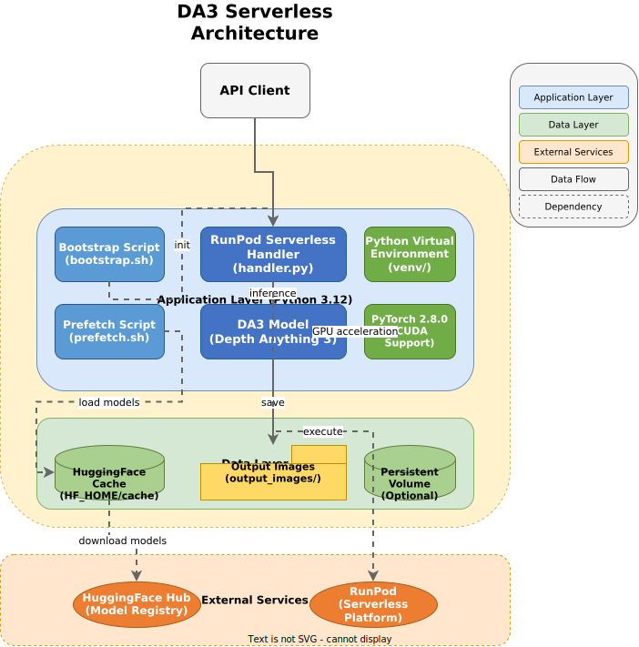
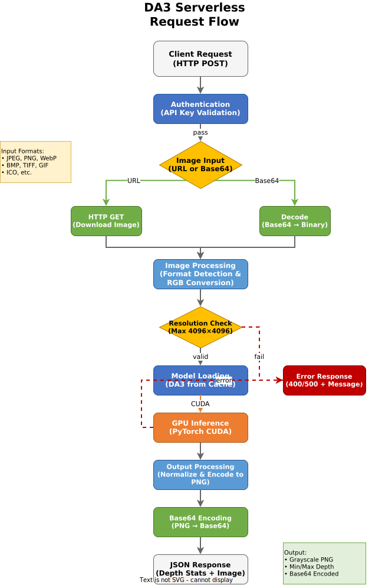

# DA3 Serverless

[](https://hub.docker.com/r/yourname/da3-serverless)
[](https://developer.nvidia.com/cuda-toolkit)
[](https://www.python.org/)
[](LICENSE)

> GPU-accelerated Depth Anything 3 (DA3) model as a RunPod serverless endpoint for metric depth estimation.

DA3 Serverless packages the Depth Anything 3 model into a production-ready Docker container that runs on GPU-enabled infrastructure. It accepts images via URL or base64 encoding and returns metric depth maps with accurate depth measurements in meters.

## ✨ Features

- **Production-Ready API**: RunPod serverless endpoint with synchronous execution (`/runsync`)
- **Multiple Input Formats**: Accepts images via URL or base64 (including data URI format)
- **Format Support**: JPEG, PNG, WebP, BMP, TIFF, GIF, ICO, and more
- **GPU Acceleration**: CUDA 12.8.1 support with PyTorch 2.9.1
- **Model Variants**: Support for multiple DA3 model architectures (Small, Large, Giant, Nested-Giant)
- **SDTHead Support**: Optional Stable Depth Transformer head with DySample upsampling (Experimental)
- **Auto-Conversion**: Handles various image modes (RGBA, L, P, etc.) with automatic RGB conversion
- **Metric Depth**: Returns accurate depth measurements in meters
- **Enhanced Visualization**: Histogram equalization with configurable percentile clipping and gamma correction for optimal tonal range
- **Flexible Auth**: Optional API key authentication (open by default if env var unset)
- **RunPod Model Caching**: Uses RunPod's platform-level model caching for fast cold starts

## 🏗️ Architecture



The system is designed as a layered Docker-based service:

1. **Infrastructure Layer**: CUDA-enabled GPU container with Ubuntu 24.04 and Python 3.12
2. **Application Layer**: RunPod serverless handler with DA3 model inference
3. **Data Layer**: HuggingFace model cache, output images, and optional persistent volume
4. **External Services**: HuggingFace Hub for model downloads, RunPod for serverless execution

## 🚀 Quick Start

### Prerequisites

- Docker with GPU support (nvidia-container-toolkit)
- NVIDIA GPU with CUDA 12.8 capability
- 16GB+ GPU RAM recommended for large models
- HuggingFace account (for model access)

### Installation

```bash
# Clone the repository
git clone https://github.com/yourusername/DA3-Serverless.git
cd DA3-Serverless

# Build the Docker image
docker build -t da3-serverless .
```

### Running the Container

```bash
# Run with GPU support (open access)
docker run --gpus all -p 8080:8080 da3-serverless

# Run with API key authentication
docker run --gpus all -p 8080:8080 \
  -e DA3_API_KEY="your-secret-api-key" \
  da3-serverless

# Run with persistent volume for model caching
docker run --gpus all -p 8080:8080 \
  -v /runpod-volume:/runpod-volume \
  da3-serverless
```

### Pre-fetching Models

To avoid first-run delays, pre-download models locally:

```bash
# From within the container or after setup
./src/prefetch.sh

# Or with environment variables
MODEL_ID="depth-anything/DA3NESTED-GIANT-LARGE" \
HF_TOKEN="your-hf-token" \
./src/prefetch.sh
```

## 📖 Documentation

### API Reference

#### Endpoint: `/runsync` (Synchronous)

**Authentication**: Optional. Only required if `DA3_API_KEY` environment variable is set.
- Header: `da3-api-key` or `DA3-API-KEY`
- Input field: `input.api_key`

#### Input Schema

```typescript
{
  input: {
    // Optional: API authentication key (if DA3_API_KEY env var is set)
    api_key?: string;

    // Required: Image source (one of)
    image_url?: string;      // Public URL to image
    image_base64?: string;   // Base64 encoded image (with or without data URI prefix)

    // Optional: Model selection
    model_id?: string;       // Default: "da3nested-giant-large"
                             // Options: "da3-small", "da3-large", "da3-giant",
                             //          "da3nested-giant-large", "da3metric-large"

    // Optional: Inference parameters
    use_ray_pose?: boolean;  // Use ray-based pose estimation (default: false)
    use_sdt_head?: boolean;  // Use SDTHead instead of DPT (default: false)

    // Optional: Depth map visualization parameters
    histogram_equalization?: boolean;  // Apply histogram equalization (default: true)
    hist_clip_limit?: number;          // Contrast limiting for hist eq, 0-0.03 (default: 0.01)
    clip_percentile_low?: number;      // Lower percentile for clipping (default: 0.5)
    clip_percentile_high?: number;     // Upper percentile for clipping (default: 99.5)
    gamma?: number;                    // Gamma correction, <1 brightens midtones (default: 1.0)
  }
}
```

#### Output Schema

```typescript
{
  // Grayscale PNG as base64 (8-bit, 0-255)
  // Histogram-equalized with percentile clipping for optimal tonal range
  image_base64: string;

  // Depth statistics in meters
  min_depth: number;        // Minimum depth value
  max_depth: number;        // Maximum depth value

  // Metadata
  head_type: string;        // Active decoder head (e.g., "DPT", "SDTHeadAdapter")
  file_path: string;        // Path to saved PNG on volume

  // Error responses
  error?: string;           // Error message (if failed)
  status?: number;          // HTTP status code (if failed)
}
```

### Configuration

| Variable | Description | Default |
|----------|-------------|---------|
| `DA3_API_KEY` | Optional authentication key. If unset, API is open. | *none* |
| `HF_TOKEN` | HuggingFace token for private models | *none* |
| `MODEL_ID` | Default DA3 model to load | `da3nested-giant-large` |
| `USE_SDT_HEAD` | Use SDTHead instead of DPT head | `false` |
| `SDT_FUSION_CHANNELS` | SDTHead fusion channel dimension | `256` |
| `WORKSPACE` | Workspace root directory | `/workspace/DA3` |

> **Note**: HuggingFace cache location is managed by RunPod at the platform level. Do not override `HF_HOME` as this will break RunPod's model caching.

### Model Variants

| Model ID | Description | GPU Memory | Speed | Accuracy |
|----------|-------------|------------|-------|----------|
| `da3-small` | Fast inference, lower accuracy | ~4GB | ⚡⚡⚡ | ★★☆ |
| `da3-large` | Balanced performance | ~8GB | ⚡⚡ | ★★★ |
| `da3-giant` | High accuracy | ~12GB | ⚡ | ★★★★ |
| `da3nested-giant-large` | State-of-the-art metric depth | ~16GB | ⚡ | ★★★★★ |
| `da3metric-large` | Metric-optimized variant | ~10GB | ⚡⚡ | ★★★★ |

### SDTHead (Stable Depth Transformer Head)

SDTHead is an alternative decoder head adapted from [AnythingDepth](https://github.com/AnythingDepth/AnythingDepth).

**Current Status:** Experimental. Pre-trained weights for the SDTHead are not currently available in the public repository. Enabling this (`use_sdt_head=true`) will use a randomly initialized decoder, resulting in poor output. This feature is integrated for future use when weights become available.

**Enable via environment variable:**
```bash
USE_SDT_HEAD=true
```

**Enable via API parameter:**
```json
{
  "input": {
    "image_url": "...",
    "use_sdt_head": true
  }
}
```

### Directory Structure (Runtime)

```
<WORKSPACE>/          # /workspace/DA3
├── venv/            # Python virtual environment with dependencies
├── src/             # Handler and scripts
│   ├── handler.py   # Main RunPod serverless handler
│   └── model/       # SDTHead module (optional)
│       ├── sdt_head.py          # SDTHead implementation
│       ├── sdt_head_adapter.py  # DA3 interface adapter
│       └── da3_sdt.py           # Head swapping utilities
├── upstream/        # DA3 source code (cloned at runtime)
└── output_images/   # Generated depth maps

# HuggingFace models cached by RunPod at platform level (default HF_HOME)
```

## 🧪 Testing

### Test Model Warmup

```bash
# Warmup with default DPT head
python src/handler.py --warmup

# Warmup with SDTHead
python src/handler.py --warmup --use-sdt-head
```

### Test API Call

```bash
# Standard request (No API Key needed if env var not set)
curl -X POST https://your-runpod-endpoint/runsync \
  -H "Content-Type: application/json" \
  -d '{
    "input": {
      "image_url": "https://example.com/sample.jpg",
      "model_id": "da3nested-giant-large"
    }
  }'

# Request with API Key (if configured)
curl -X POST https://your-runpod-endpoint/runsync \
  -H "Content-Type: application/json" \
  -H "da3-api-key: YOUR_KEY" \
  -d '{
    "input": {
      "image_url": "https://example.com/sample.jpg"
    }
  }'
```

### Test with Base64 Image

```bash
# Encode image to base64
IMAGE_BASE64=$(base64 -w 0 sample.jpg)

# Make request
curl -X POST https://your-runpod-endpoint/runsync \
  -H "Content-Type: application/json" \
  -d "{
    \"input\": {
      \"image_base64\": \"${IMAGE_BASE64}\",
      \"model_id\": \"da3nested-giant-large\"
    }
  }"
```

## 🔧 Development

### Local Development Setup

```bash
# Create virtual environment
python3.12 -m venv venv
source venv/bin/activate

# Install PyTorch with CUDA support
pip install torch==2.9.1 torchvision==0.24.1 \
  --index-url https://download.pytorch.org/whl/cu128

# Install dependencies
pip install -r requirements.txt

# Clone DA3 repository
git clone https://github.com/ByteDance-Seed/Depth-Anything-3.git ext_code/Depth-Anything-3

# Install DA3 from source
cd ext_code/Depth-Anything-3
pip install -e .

# Install gsplat for 3D Gaussian Splatting support
pip install --no-build-isolation \
  git+https://github.com/nerfstudio-project/gsplat.git@0b4dddf04cb687367602c01196913cde6a743d70
```

### Building for Production

```bash
# Build optimized image
docker build -t da3-serverless:latest .

# Tag for registry
docker tag da3-serverless:latest yourname/da3-serverless:v1.0.0

# Push to registry
docker push yourname/da3-serverless:v1.0.0
```

## 📊 Data Flow



1. **Request Reception**: RunPod receives HTTP POST to `/runsync`
2. **Authentication**: Optional API key validation
3. **Image Loading**: Image loaded from URL (HTTP GET) or decoded from base64
4. **Format Validation**: Image format validated and converted to RGB if needed
5. **Resolution Check**: Image size verified (max 4096×4096)
6. **Model Loading**: DA3 model loaded (cached between requests)
7. **Inference**: Depth prediction run on GPU
8. **Output Processing**: Depth map normalized (histogram equalization + percentile clipping + gamma) to 8-bit grayscale
9. **Encoding**: PNG encoded to base64
10. **Response**: JSON returned with depth statistics, head info, and image data

## 🤝 Contributing

Contributions are welcome! Please follow these guidelines:

1. Fork the repository
2. Create a feature branch (`git checkout -b feature/amazing-feature`)
3. Commit changes (`git commit -m 'Add amazing feature'`)
4. Push to branch (`git push origin feature/amazing-feature`)
5. Open a Pull Request

### Development Guidelines

- Follow PEP 8 for Python code style
- Add tests for new features
- Update documentation for API changes
- Use semantic versioning for releases

## 🐛 Troubleshooting

### Common Issues

**Issue**: "CUDA out of memory"
- **Solution**: Use a smaller model variant (e.g., `da3-small` or `da3-large`)

**Issue**: "Model download failed"
- **Solution**: Set `HF_TOKEN` environment variable for HuggingFace authentication

**Issue**: "Image too large"
- **Solution**: Resize input image to max 4096×4096 pixels before sending

**Issue**: "Unauthorized" error
- **Solution**: Check if `DA3_API_KEY` is set in environment. If so, provide it in headers or input.

## 📄 License

This project includes code from:

- **Depth Anything 3**: [Apache 2.0 License](https://github.com/ByteDance-Seed/Depth-Anything-3/blob/main/LICENSE)
- **DA3 Serverless**: MIT License - see [LICENSE](LICENSE) for details

## 🙏 Acknowledgments

- [Depth Anything 3](https://github.com/ByteDance-Seed/Depth-Anything-3) by ByteDance Seed Team
- [RunPod](https://www.runpod.io/) for serverless GPU infrastructure
- [HuggingFace](https://huggingface.co/) for model hosting and distribution
- [PyTorch](https://pytorch.org/) for deep learning framework

## 📚 Additional Resources

- [Depth Anything 3 Paper](https://arxiv.org/abs/XXXX.XXXXX)
- [DA3 API Documentation](https://github.com/ByteDance-Seed/Depth-Anything-3/blob/main/docs/API.md)
- [RunPod Serverless Docs](https://docs.runpod.io/serverless)
- [CUDA Installation Guide](https://developer.nvidia.com/cuda-downloads)

## 🔗 Links

- [GitHub Repository](https://github.com/yourusername/DA3-Serverless)
- [Docker Hub](https://hub.docker.com/r/yourname/da3-serverless)
- [Issue Tracker](https://github.com/yourusername/DA3-Serverless/issues)
- [Discussions](https://github.com/yourusername/DA3-Serverless/discussions)
